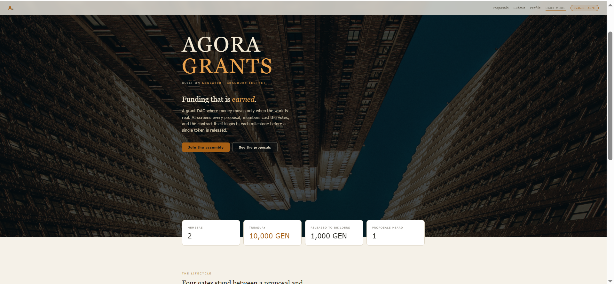
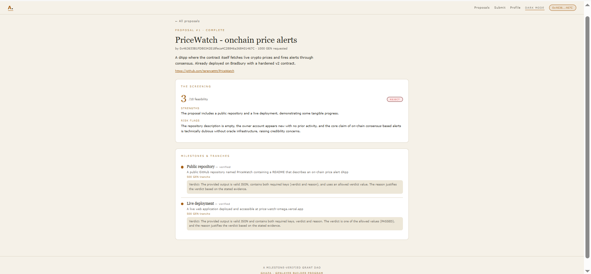
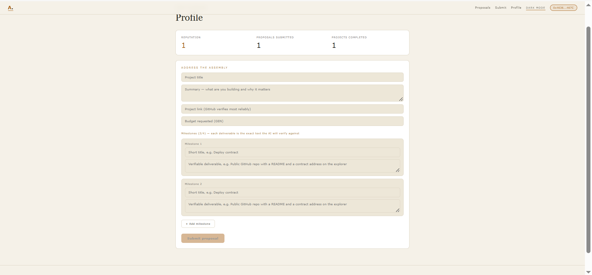

# Agora Grants 🏛️

**A milestone-verified grant DAO on GenLayer — where money moves only when the work is real.**

Live app: **https://agora-grants.vercel.app**
Contract (Bradbury Testnet): [`0x87d300D4F0774775a25189C67De9Dc79a5671C1a`](https://explorer-bradbury.genlayer.com/address/0x87d300D4F0774775a25189C67De9Dc79a5671C1a)

---

## The idea

Grant programs have a trust problem: somebody has to check that funded work was actually delivered — and humans can be lazy, biased, or bribed. Agora Grants replaces that somebody with the chain itself.

- **AI due diligence, on-chain.** Before any vote, anyone can trigger a screening: the Intelligent Contract fetches the proposal's project link (GitHub API) and validators reach consensus on a diligence report — feasibility score, strengths, risk flags, FUND/REJECT — written permanently to state. *The AI advises; it never decides.*
- **The assembly votes.** One wallet, one voice. Quorum finalizes the verdict on-chain.
- **Funds release milestone by milestone.** Each milestone's tranche unlocks **only after the contract itself fetches the submitted evidence and validator consensus judges it against the exact deliverable text from the original proposal.** PASSED → tranche released, next milestone activates. FAILED → resubmit and try again.
- **Reputation is earned.** Completing all milestones mints an on-chain reputation point, queryable by future proposals.

No oracle. No trusted committee. The judge is the network.

## The proof (all on-chain, proposal #1)

The first proposal put a real shipped project — [PriceWatch](https://github.com/terencetttt/PriceWatch) — through the full lifecycle:

1. The AI screener came back **3/10 — REJECT**, flagging an empty repo description and doubting that "on-chain consensus-based alerts" are even possible *(while itself being exactly that)*.
2. The assembly voted **2–0 to overrule it.** The code obeyed the humans: 1,000 GEN allocated.
3. Milestone 1 evidence (a repo link) was judged **FAILED** — the GitHub API metadata didn't show the promised README. The judge couldn't be sweet-talked; it demanded proof.
4. Resubmitted with the raw README URL → **PASSED**. 500 GEN tranche released.
5. Milestone 2 (the live app) → **PASSED**. Proposal **COMPLETE**, 1,000/1,000 GEN released, reputation +1.

Two independent AI consensus mechanics — screening and verification — both holding consensus on the first deployed contract version.

## Screenshots

| Home | Proposal detail | Profile |
|---|---|---|
|  |  |  |

## Stack

- **Intelligent Contract:** Python (`contract/agora_grants.py`) — `gl.eq_principle.prompt_non_comparative` for both AI paths with tolerance-aware criteria; every fetch/parse/LLM call wrapped; failures preserve state for clean retries; `TreeMap[str, str]` JSON storage; no time-based logic (quorum by count)
- **Frontend:** Vue 3 + TypeScript + genlayer-js 1.1.8 — light/dark theming, scroll-reveal animations, EIP-55 address normalization
- **Network:** GenLayer Bradbury Testnet via Studio

## Design limitations (deliberate, documented)

- Treasury is **virtual accounting units** — real on-chain bookkeeping, symbolic custody (testnet demo)
- One-wallet-one-vote is sybil-able; reputation-weighted voting is the natural v2
- Milestone verification judges what is **publicly fetchable** (repos, live pages) — it replaces the lazy/bribable checker, not a security auditor
- No deadlines: GenLayer contracts have no reliable clock, so quorum is by count, not time

## Run it locally

```bash
git clone https://github.com/terencetttt/AgoraGrants
cd AgoraGrants
npm install
echo "VITE_CONTRACT_ADDRESS=0x87d300D4F0774775a25189C67De9Dc79a5671C1a" > .env
npm run dev
```

---

*Built by GHAZA for the GenLayer Incentivized Builder Program.*
